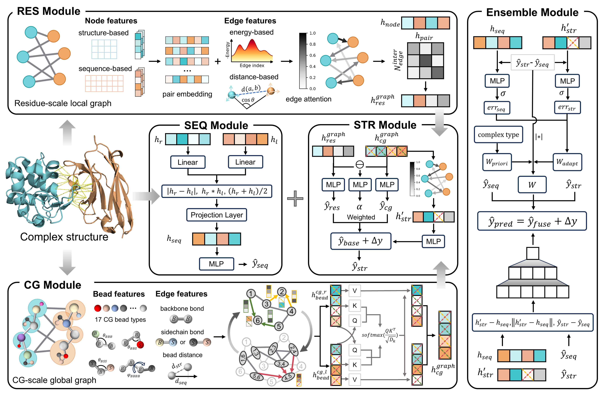

# Description

**UniBA** is a unified multimodal framework for protein complex binding affinity prediction. It integrates paired sequence representations with multi-scale structural modeling, including residue-level interface graphs and coarse-grained molecular graphs, through a dynamic fusion strategy to predict binding affinity across diverse protein interaction systems.
  

## Reproduction status

The raw-PDB workflow was tested end to end on Linux on 2026-07-30 with one
representative from every dataset:

| Dataset | Pair | Raw-to-graph | Fold-0 prediction |
| --- | --- | --- | ---: |
| PPI | `1a22_A_B` | passed | 8.00357 |
| AAI | `1bj1_HL_W` | passed | 8.34333 |
| TCR-pMHC | `1ao7_DE_CA` | passed | 5.88164 |

The test covered chain extraction/remapping, MINT, ESM2, ESM-IF, DSSP,
GHECOM, GraphRicciCurvature, PLIP/Open Babel, Martini 2.2, Gromacs energy
minimization, energy features, residue graphs, coarse-grained graphs, checkpoint
loading, and model inference.

## 1. Clone and validate the source

Run all commands from the repository root on a Linux machine:

```bash
python scripts/validate_public_release.py --github
python scripts/validate_reproducibility.py --mode metadata
```

Expected metadata totals are 2,328 PPI, 772 AAI, and 227 TCR-pMHC pairs,
for exactly 3,327 label and raw-PDB records.

## 2. Create the Python environments

The tested main stack uses Python 3.10.20, PyTorch 2.0.1 with CUDA 11.8,
PyTorch Geometric 2.7.0, and torch-scatter 2.1.2. PLIP is isolated because
Open Babel has its own binary dependencies.

```bash
bash scripts/setup_conda_envs.sh
conda activate uniba_repro
```

Equivalent environment specifications are in `envs/uniba-cu118.yml` and
`envs/plip.yml`. CPU users must install a matching CPU build of PyTorch and
torch-scatter instead of the CUDA 11.8 wheels used by the setup script.

## 3. Restore the two release archives

Only two large project assets are required:

| File | Contents | Size | SHA256 |
| --- | --- | ---: | --- |
| `uniba_raw_pdb.tar.zst` | 3,327 chain-selected pair PDBs | about 215 MB | `3cc298c5ac9c0393b12b5f857a0f3a15e08f7638e80f7a3d77d190fb5160009a` |
| `uniba_checkpoints.tar.gz` | five UniBA fold checkpoints | about 352 MB | `684b32a51793d460d3ea78a85ae6051693998ca265f9bfa1175098818d7cdbfa` |

The release also contains two small text files:

- `SHA256SUMS` verifies that both downloaded archives are intact.
- `uniba_raw_pdb.files` lists the 3,327 PDB members for auditing; it is not
  input to the model.

After the maintainer uploads these four files to a GitHub Release or Zenodo,
set the real release directory URL:

```bash
export UNIBA_ARTIFACT_BASE_URL=https://github.com/hzau-liulab/UniBA/releases/download/v1.0.0
bash scripts/download_artifacts.sh
(cd artifacts && sha256sum -c SHA256SUMS)
bash scripts/restore_artifacts.sh
python scripts/validate_reproducibility.py --mode raw
python scripts/validate_reproducibility.py --mode checkpoints
```

The release assets used to reproduce the published experiments are also stored
on the tested server in:

```text
/data/user/stli/NAcontact/CCC_release_artifacts/
```

The corrected AAI member is `data/pdb_files/aai/1bj1_HL_W.pdb`, containing
chains H, L, and W. Pair IDs, labels, splits, feature names, and graph names
must always use the same identifier.

## 4. Download MINT and ESM model assets

These pretrained encoders are third-party dependencies, not UniBA outputs:

```bash
conda activate uniba_repro
bash scripts/download_external_models.sh
```

The script downloads the official MINT checkpoint from Hugging Face and
verifies this checksum:

```text
84a4016365997cd9f0bccb07d746fa8f076ffd8e45aa0cbcf4e50a037161a342  mint.ckpt
```

It also downloads `esm2_t33_650M_UR50D` and
`esm_if1_gvp4_t16_142M_UR50`. Set `MINT_URL` to a trusted mirror when the
official Hugging Face endpoint is inaccessible.

## 5. Install the external command-line tools

The following tools cannot be replaced by files generated by this repository:

| Tool | Purpose | Tested version |
| --- | --- | --- |
| PLIP / Open Babel | residue interaction features | PLIP 2.4.0 / Open Babel 3.1.1 |
| DSSP (`mkdssp`) | secondary structure and accessibility | 3.0.0 |
| GHECOM | pocket descriptors | build dated 2021-12-01 |
| GraphRicciCurvature | curvature features | 0.5.3.2, installed by pip |
| Gromacs | Martini minimization and energy inputs | 2022.4 |
| legacy `martini.py` | Martini 2.2 coarse graining | script version 2.2 |

The exact tested legacy `martini.py` has SHA256:

```text
aae4cbfed4a42517a2b418cbc6677f9c784bc273119e04da620ead7cca301353
```

It is a third-party Martini tool and requires Python 2.7 in the tested path.
Install or obtain DSSP, GHECOM, Gromacs, and the legacy Martini script from
their upstream projects, then record their absolute paths in the next step.
PSAIA is not used by the released 18-dimensional handcrafted feature path and
may remain empty.

## 6. Configure the raw-PDB pipeline

Create a machine-local configuration; this file is ignored by Git:

```bash
cp scripts/raw_pdb_pipeline.env.example scripts/raw_pdb_pipeline.env
```

Edit these values:

```text
PYTHON_BIN
MINT_CHECKPOINT
ESM_PATH
DSSP_BIN
GHECOM_BIN
PLIP_BIN
MARTINIZE_SCRIPT
MARTINIZE_PYTHON
GMX_BIN
```

Reference paths used for the successful server test were:

```text
PYTHON_BIN=/data/user/stli/miniconda3/envs/uniba_repro/bin/python
MINT_CHECKPOINT=/data/user/stli/NAcontact/CCC_external_assets/mint/mint.ckpt
ESM_PATH=/data/user/stli/NAcontact/CCC_external_assets/esm_cache
DSSP_BIN=/data/user/stli/miniconda3/envs/EGARPS/bin/mkdssp
GHECOM_BIN=/data/user/stli/soft/ghecom/ghecom
PLIP_BIN=/data/user/stli/miniconda3/envs/uniba_plip/bin/plip
MARTINIZE_SCRIPT=/data/user/stli/NAcontact/data/sabdab/cg_input/py/martini.py
MARTINIZE_PYTHON=/data/user/stli/miniconda3/envs/martinize_py2/bin/python
GMX_BIN=/data/user/stli/miniconda3/envs/gmxMMPBSA/bin/gmx
```

Preview the resolved commands before spending GPU/CPU time:

```bash
bash scripts/run_raw_pdb_feature_pipeline.sh \
  --env-file scripts/raw_pdb_pipeline.env --dry-run
```

## 7. Generate every feature and graph

Run the full workflow:

```bash
bash scripts/run_raw_pdb_feature_pipeline.sh \
  --env-file scripts/raw_pdb_pipeline.env
python scripts/validate_reproducibility.py --mode generated
```

The stages can be resumed independently after a failure:

```bash
# Raw pair PDB -> mapped complex, per-chain PDB, and FASTA
bash scripts/run_raw_pdb_feature_pipeline.sh \
  --env-file scripts/raw_pdb_pipeline.env --stages data

# MINT, ESM, handcrafted, PLIP, Martini/Gromacs, and energy features
bash scripts/run_raw_pdb_feature_pipeline.sh \
  --env-file scripts/raw_pdb_pipeline.env \
  --stages mint,seqstr,handnorm,plip,cgprep,energy

# Residue and coarse-grained graphs
bash scripts/run_raw_pdb_feature_pipeline.sh \
  --env-file scripts/raw_pdb_pipeline.env --stages graphs
```

Set `DATASETS=ppi`, `DATASETS=aai`, or `DATASETS=tcr-pmhc` before the command
to resume one dataset. The pipeline skips complete Martini outputs and existing
graphs. If conjugate-gradient minimization fails for a structure, the wrapper
automatically retries with steepest descent and records
`MINIMIZATION_FALLBACK.txt` in that pair's CG directory.

Full generation is much larger than the 215 MB raw archive. ESM checkpoints,
per-residue features, PLIP reports, solvated Gromacs systems, energy matrices,
and graph files can require hundreds of GB. Check disk space before a full run.
These files are intentionally excluded from Git.

## 8. Run inference or training

After all features and graphs for a requested split exist:

```bash
# Five-fold released model on data/split_data/cv/test_pair.txt
python UniAffinity.py --test --cv 5 --dataset test

# Individual external test split
python UniAffinity.py --test --cv 5 --dataset test1

# Full retraining, followed by testing the new checkpoints
python UniAffinity.py --train --no-test --cv 5 --num_epochs 100
python UniAffinity.py --test --cv 5 --dataset test
```

Predictions are written under `output/UniBA_wo_res/`; analysis tensors are
written under `analysis_graph/`. Both directories are ignored by Git.

## 9. Data contract and layout

A pair ID has the form `PDB_partner1chains_partner2chains`. For example,
`1akj_DE_AB` assigns D/E to partner 1 and A/B to partner 2. The data preparation
stage maps selected chains to A, B, C, ... in partner order for all downstream
tools.

```text
data/PPB-Affinity/          three canonical pair lists (3,327 complexes)
data/split_data/cv/         train/validation/test splits
data/affinity_data/         labels, Martini templates, and generated graph roots
data/pdb_files/             restored raw PDBs and generated mapped PDBs
feature/mint/               vendored MINT architecture and sequence metadata
feature/                    feature-generation code and generated outputs
model/                      UniBA modules
utils/                      graph/model utilities
scripts/                    setup, pipeline, validation, and training entrypoints
envs/                       tested Conda specifications
```

The empty generated-output directories visible on the server are not source
folders that need uploading; Git does not track empty directories. This
`README.md` is the repository's only Markdown documentation. See `LICENSE`,
`CITATION.cff`, and the source paper for licensing and citation information.
